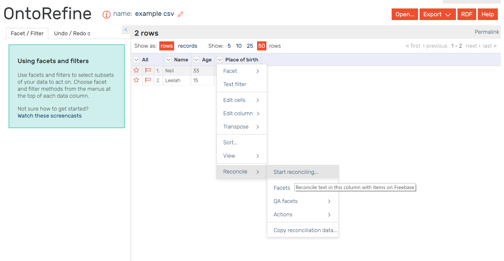

In this tutorial you will learn how to create Linked Data representation of a 
simple table using software tools.
The source for conversion is a table in a *.csv format. With the help of GraphDB this CSV-file 
will be converted into Linked Data and stored in GraphDB.

--------------

## Content
---
- [Step 0: Let’s make a table](#step0)
- [Step 1: Upload Data via OntoRefine](#step1)
- [Step 2: Make an RDF representation of your table](#step2)
- [Step 3: Import RDF data in GraphDB](#step3)
- [Step 4: Make your RDF Linked Data](#step4)
- [Step 5: Do it yourself](#step5)
---------------

**Comma-separated values (CSV)** is a widespread format for spreadsheets and simple databases.
It uses plain text to store tabular data. Each record consists of one or more fields (columns),
separated by commas. This format is not standardized, but the idea to separate values using an agreed
upon delimiter is very simple. There are many variants including tab-separated values and
space-separated values.

Therefore, first of all, we need a table.

### Step 0: Let's make a table <a name="step0"></a>

Bellow is a simple **CSV** table that lists names of 2 persons together with their age and places of birth.
In **CSV** this looks very simple:

```csv
Name,Age,Place of birth
Neil,2,Enschede
Leela,5,Utrecht
```

You can copy the example from above and paste it in a text file. 
Or just [download it](https://1drv.ms/u/s!Ah2_2X7uyAX5iNhG5jxgU27tPh19Bw)

And this is a rendered version:

| Name | Age | Place of birth |
| ---- | --- | -------------- |
| Neil | 2 | Enschede |
| Leela | 5 | Utrecht |

This data will be converted into RDF using GraphDB in the next step.
 
### Step 1: Upload Data into OntoRefine <a name="step1"></a>

Once the table is created it can be uploaded into GraphDB for transformation into LD and importing. 

>GraphDB OntoRefine is a data transformation tool, based on [OpenRefine](http://openrefine.org/) and integrated in the 
GraphDB Workbench. It can be used for converting tabular data into RDF and importing it 
into a GraphDB repository, using simple SPARQL queries and a virtual endpoint. 
The supported formats are TSV, CSV, *SV, XLS, XLSX, JSON, XML, RDF as XML, 
and Google sheet. Using OntoRefine, you can easily filter your data, edit its 
inconsistencies, convert it into RDF, and import it into a repository.

Follow the tutorial on how [to upload data into OntoRefine](http://graphdb.ontotext.com/documentation/8.9/free/loading-data-using-ontorefine.html#what-s-in-this-document) 

### Step 2: Make an RDF representation of your table.  <a name="step2"></a>
If you click RDF button in OntoRefine you will be able to see an RDFized version of the table. This is a proper 
valid RDF where rows and columns from the table are mapped with the help of the following URIs:

- `mydata:Row` - the RDF type for each row;
- `mydata:rowNumber` - the property for row number as an integer literal;
- `mydata:<column_name>` - properties for each column

### Step 3: Import RDF data in GraphDB.  <a name="step3"></a> 
When you are satisfied with the transformation of your data, you can import it in 
the current repository without leaving the GraphDB Workbench. 

Click *Data* -> *Open in main SPARQL endpoint*

The query is the same as the previous one only with the addition of a `SERVICE` clause. 
You only have to change `CONSTRUCT` to `INSERT` and remove the `LIMIT`. Instead of showing the RDF,
 GraphDB will insert it into the current repository.

### Step 4: Make your RDF-data Linked Data <a name="step4"></a>
Data that were just created and upload to a triple store is a four star data. 
It follows tree out of the [four linked data design rules](https://www.w3.org/DesignIssues/LinkedData.html).
In this step we will implement the fourth rule, namely:

> - Include links to other URIs so that people can discover more things

For example, the data for this tutorial contained information about the place of birth. 
In the table, these values (e.g "Utrecht") were represented as literals (strings). Unfortunately, 
it is not possible to link data to literal values in RDF. Therefore, in order to discover more things about
 the places of birth this information should be linkable e.i by being represented as a valid URI.
 
 In the concept of the Semantic Web HTTP URIs are used as names for real-world objects and abstract concepts
 rather than as addresses for Web documents. For example, `http://www.wikidata.org/entity/Q803` is a URI identifier for Utrecht 
 in [Wikidata](https://www.wikidata.org/wiki/Wikidata:Main_Page). Any information related to Utrecht will be linked to this URI. 
 Therefore, we need to substitute literal values of places with relevant URIs from Wikidata. THis will link our data to Wikidata. 
 OntoRefine is able to help us with such linking. 
 
 In ontorefine select dropdown menue for the place of birth column and click reconsile -> start reconsilitation as follows: 
 
 
 
 Select service - Wikidata(en)
 
 
 


### Step 5: Do it Yourself! <a name="step5"></a>
Repeat the steps of this tutorial but use your own data with your real name, age and your place of birth. 


