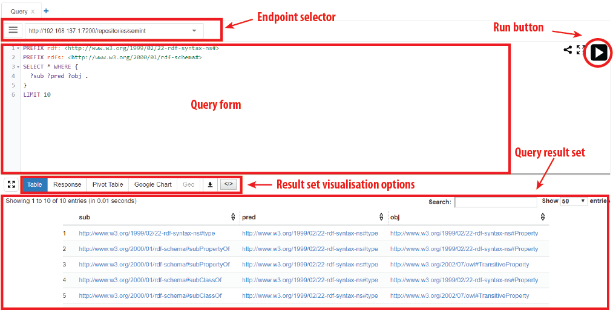

In this tutorial you will learn how to query Linked Data. 
[SPARQL](https://www.PAw3.org/TR/sparql11-query/) is the query language for the Semantic Web and Linked Data.
SPARQL is very expressive and capable of federated querying. The former allows constructing complex queries 
when the latter gives possibility to query more than one repository on runtime.
As a consequence, it is dead easy to make a query that crashes any repository. 
Therefore, make sure that your queries don't multiply everything by everything.

---------------

## Content
---
- [Use Limit](#limit)
- [Query interface](#yasgui)
- [2. Step 1](#step1)

--------------

## Use LIMIT  <a name="#limit"></a>

Even though most of the repositories set limitations on query runtime and the number
of output triples to protect the service, it is a good practice to use ***LIMIT*** keyword in your queries to limit number of triples that triple store returns.
Using ***LIMIT*** will increase your performance of query development because you
will not waste time waiting while a triplestore sends back millions of triples that you don't
need for development.

For example, the default query with a limit set to 100 will retrieve only first 100 triples:

```SPARQL
SELECT ?s ?p ?o
{?s ?p ?o}
Limit 100
```

### Query interface   <a name="#yasgui"></a>

For this tutorial we will use the [YasGUI: Yet Another SPARQL Graphical User Interface](http://yasgui.org/). 
It has quite common appearance for such interfaces. 
From the figure below you can see that it consists of four main elements as follows:
1. endpoint selector
2. query form
3. query result set
4.  buttons to control the visualisation of the query results. 

The *run* button executes the query given in the *query form* against the endpoint specified 
in the *endpoint selector*. The results of the query are rendered in the *query result set*
 using visualisation technique from a number of *visualisation options*. 



By default the query interface is aimed at the SPARQL endpoint of <http://virtuoso.almere.pilod.nl:8890/sparql> .
The initial query in the Query form retrieves everything from that endpoint.
This the query:

```SPARQL
SELECT ?s ?p ?o
{?s ?p ?o}

```

If you click the run button you will have **all the triples** available in a triple store.

The dataset selector focuses the query only on one dataset.
In the world of Linked Data datasets are represented as named graphs,
therefore selecting a dataset will add the **GRAPH** keyword that allows to specify which graph to query within a triple store.
For example, the following query will retrieve all the triples from the graph with URI
<http://linkdale.org/data/test> :

```SPARQL
SELECT ?subject ?predicate ?object
WHERE {
  GRAPH <http://linkdale.org/data/test> {
    ?subject ?predicate ?object}
}
```
