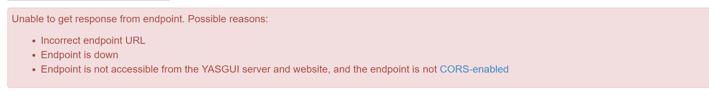
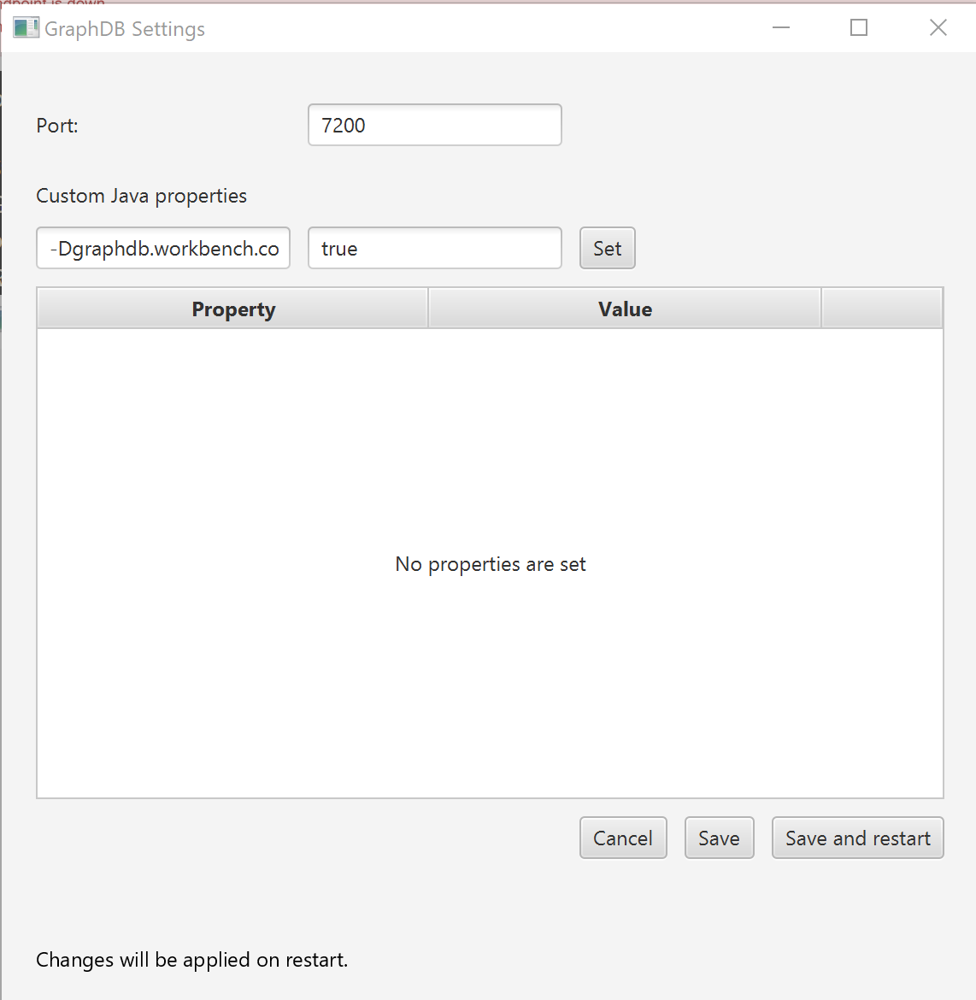

<link href='https://cdn.jsdelivr.net/npm/yasgui@2.7.29/dist/yasgui.min.css' rel='stylesheet' type='text/css'/>
<script src='https://cdn.jsdelivr.net/npm/yasgui@2.7.29/dist/yasgui.min.js'></script>

Tutorials and assignments of this course require installation of a triplestore
to recreate a common architecture of Linked Data applications. 

---------------

## Content
---
- [The triplestore](#backend)
- [Installation of GraphDB](#graphdb)
- [Test the installation](#test)
- [Allow requests from other domains](#cors) 

---------------

## The triplestore <a name="backend"></a>
Databases built for the storage and retrieval of triples using semantic queries are called triplestores. 
The list of existing implementation is quite impressive and includes about 50 different solutions. 


For this tutorial we will install and use **[GraphDB](https://www.ontotext.com/products/graphdb/)**, 
developed by [Ontotext](https://www.ontotext.com/), because it has: 
- a lovely Graphical User Interface
- a support of [geoSPARQL](http://graphdb.ontotext.com/documentation/free/geosparql-support.html)
- a free version

## Installation of GraphDB <a name="graphdb"></a>
The triple store can be installed in four steps as follows:

- **Step 1.** Go to the [page of GraphDB](https://www.ontotext.com/products/graphdb/graphdb-free/) to get a free copy of the software.
- **Step 2.** Fill the form and request a link to your copy of the software. You should receive a email with download links. 
- **Step 3.** Download and install a desktop version of the software for your platform (see [quick start quide](http://graphdb.ontotext.com/documentation/8.9/free/quick-start-guide.html#run-graphdb-as-a-desktop-installation)).   
- **Step 4.** Run GraphDB. The Web interface of the triple store is available at [http://localhost:7200/](http://localhost:7200/).

## Test the installation <a name="test"></a>
If you have GraphDB running at [http://localhost:7200/](http://localhost:7200/) then create 
a test repository and run your first SPARQL query as follows:  

- **Step 5.** Create a test repository with repository ID *test*. [See instructions on how to...](http://graphdb.ontotext.com/documentation/8.9/free/quick-start-guide.html#create-a-repository).
- **Step 6.** Query the created repository. GraphDB automatically loads core vocabularies to 
a new repository. These can be queried. Therefore, select the created repository from the 
 drop down menu, and click the SPARQL menu tab. Run the default query that returns 
 the first 100 triples from the repository:
 
 ```` sparql
 select * 
 where {
      	?s ?p ?o .
     } limit 100      
````
If everything works fine you will see query results rendered as a table. 

## Allow requests from other domains <a name="cors"></a>
It is possible to run [federated queries](https://www.w3.org/TR/2013/REC-sparql11-federated-query-20130321/) from the GraphDB Workbench. 
However, in order to allow querying your data by browser-based applications you need to 
enable the [Cross-Origin Resource Sharing (CORS)](https://developer.mozilla.org/en-US/docs/Web/HTTP/CORS) in your GraphDB. 
Follow the next few steps to open up your data to the world:

- **Step 7.** Learn the endpoint address of your GraphDB. Go to *Setup* -> *Repositories* 
and *copy repository URL to clipboard*. See the figure:

  
  
  In GraphDB, the generic schema for the repository URL looks 
  like:

  ```
  http://{ip_address}:{port}/repositories/{repository_ID}
  ```
  it is also equivalent to 
  
  
  ```
  http://localhost:{port}/repositories/{repository_ID}
  ```
  
   Such a repository URL can be used to query local data from external Web pages via SPARQL protocol
  which makes it a part of the Web of Data. The URL is generated automatically every time you restart GraphDB. 
  
- **Step 8.**<a name="step8"></a>  Query your data from within browser-run apps. You can use different query interfaces to 
query your data using the repository URL. 
[YASGUI (Yet Another SPARQL GUI)](http://yasgui.org/) is an example of such an interface. 
Therefore, lets try to query data in your local instance of GraphDB from the page your are reading. 
YasGui interface is deployed into this page. In the form below, 
provide the address of the endpoint (`http://localhost:7200/repositories/test`) and click the run button. 

<div id='yasgui'></div>  
<script type="text/javascript">
    var yasgui = YASGUI(document.getElementById("yasgui"), {
        //Uncomment below to change the default endpoint
        //Note: If you've already opened the YASGUI page before, you should first clear your
        //local-storage cache before you will see the changes taking effect
        yasqe:{sparql:{endpoint:'http://localhost:7200/repositories/test'}}
    });
</script>


If you are able to see the results of the query then congratulation, you are done with all the prerequisite. 

If you see something like:

Then follow the next step. 

- **Step 9.**  Enable the [Cross-Origin Resource Sharing (CORS)](https://developer.mozilla.org/en-US/docs/Web/HTTP/CORS). 
Open the settings window of GraphDB by double-clicking the GraphDB icon in the system tray. 
Enable the CORS support by setting the `-Dgraphdb.workbench.cors.enable` to `true` . 
Click *Set* and then *Save and Restart* to start your GraphDB with new settings. 
 

Try to query the data via YasGUI as described in [**Step 8**](#step8).