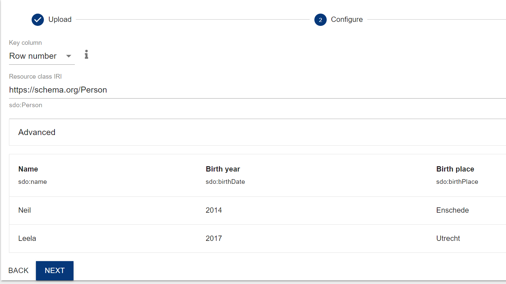

In this tutorial you will learn how to create Linked Data representation of a 
simple table using software tools.
The source for conversion is a table in a *.csv format. With the help of GraphDB this CSV-file 
will be converted into Linked Data and stored in GraphDB.

--------------

## Content
---

- [Step 0: Let’s make a table](#step0)
- [Step 1: From table to graph in one spell](#step1)
  - [Upload data into the GeoData Wizard](#step1.1)
  - [Data mapping](#step1.2)
  - [Export data](#step1.3)
- [Step 2: Make your RDF Linked Data](#step2)
- [Step 3: Load data into GraphDB and query it](#step3)
- [Step 4: Do it yourself](#step4)

---------------

**Comma-separated values (CSV)** is a widespread format for spreadsheets and simple databases.
It uses plain text to store tabular data. Each record consists of one or more fields (columns),
separated by commas. This format is not standardized, but the idea to separate values using an agreed
upon delimiter is very simple. There are many variants including tab-separated values and
space-separated values.

Therefore, first of all, we need a table.

### Step 0: Let's make a table <a name="step0"></a>

Bellow is a simple **CSV** table that lists names of 2 persons together with their age and places of birth.
In **CSV** this looks very simple:

``` csv
Name,Birth year,Birth place
Neil,2017,Enschede
Leela,2014,Utrecht
```

You can copy the example from above and paste it in a text file. 
Or just [download it](https://1drv.ms/u/s!Ah2_2X7uyAX5iNhG5jxgU27tPh19Bw)

And this is a rendered version:

| Name | Birth year | Birth place |
| ---- |------------|---------------------------|
| Neil | 2017       | Enschede                  |
| Leela | 2014       | Utrecht                   |

This data will be converted into RDF using [GeoDataWizard](https://labs.kadaster.nl/innovatie/geodatawizard/demonstrator/) in the next step.
 
### Step 1: From table to graph in one spell <a name="step1"></a>

Once the table is created it can be converted into Linked Data.
Structured and semi-structured spatiotemporal
data can be transformed into LInked Data in three steps:
1. syntactic translation of the data into RDF,
2. semantic annotation and transformation of this RDF using semantic standards, 
3. linking the results to other RDF resources.

Many software solutions exist that provide functionality for these three tasks (e.g., [Openrefine](https://openrefine.org/)). 
In this tutorial, we will use the [GeoData Wizard](https://labs.kadaster.nl/innovatie/geodatawizard/demonstrator/).
It has user interafce which is friendly to LD novices and it allows the user to perform all three tasks. 

#### Step 1.1 Upload data into the GeoData Wizard <a name="step1.1"></a>

Load your data into the [tool](https://labs.kadaster.nl/innovatie/geodatawizard/demonstrator/). 

#### Step 1.2: Data mapping  <a name="step3"></a> 

The wizard does _syntactic translation_ automatically.
Since the structure of the input data is known, the software can map the structure of the source data to the graph data model of RDF.
Triple is an atomic structure of an RDF graph consisting of three parts, namely subject, predicate, and object. 
Therefore, the aim of this mapping is to identify elements in the source data 
(e.g., a column of a table in our case, but it also can be an array or a string, an XML or JSON node)
and to assign them to one of the elements of a triple. 

However, _semantic annotation and transformation_ requires human input, 
because the meaning of the data is unknown to the system. 
The configure screen of the GeoData Wizard allows users to specify meaning of the data elements. 



It includes following fields: 

- **Key Column** is a column that will be used to create unique identifiers for your data items. In our case we ask the software to create URIs automatically using number of rows. 
- **Resource Class IRI** is an identifier of the class of the objects your data has. In our case, the table is about people, therefore we will use the class _person_ from the _schema.org_ ontology. 
- **Table fields** allows user to identify meaning of each column. We will continue to use schema.org for this perpuse and assign the following properties: 

| Column name | RDF property                  |
|-------------|-------------------------------|
| Name        | https://schema.org/name       |
| Birth year  | https://schema.org/birthDate  |
| Birth place | https://schema.org/birthPlace |

When you are done with configuring your data transformation, you can click **Next** and contunue to the publish step. 

#### Step 1.3: Export data  <a name="step3"></a>

The GeoData Wizard provides three options:
1. Download source data
2. Download resulted RDF
3. Download transformation script

You need to choose the second option and download RDF. 

### Step 2: Make your RDF-data Linked Data <a name="step4"></a>

Data that were just created is a four-star data. 
It follows tree out of the [four linked data design rules](https://www.w3.org/DesignIssues/LinkedData.html).

In this step we will implement the fourth rule, namely:

> - Include links to other URIs so that people can discover more things

For example, the data for this tutorial contained information about the place of birth. 
In the table, these values (e.g "Utrecht") were represented as literals (strings). Unfortunately, 
it is not possible to link data to literal values in RDF. 
Therefore, in order to discover more things about
 the places of birth this information should be linkable e.i by being represented as a valid URI.
 
 In the concept of the Semantic Web HTTP URIs are used as names for real-world objects and abstract concepts
 rather than as addresses for Web documents. 
 For example, `https://dbpedia.org/resource/Utrecht` is a URI identifier for Utrecht 
 in [DBpedia](https://dbpedia.org/). 
 Any information related to Utrecht will be linked to this URI. 
 Therefore, we need to substitute literal values of places with relevant URIs from DBpedia. 
 This will link our data to DBpedia. 
 
We will use simple Notepad to perform this linking. 
Open the files that you created with the GeoData Wizard and find triples that describe places of births. For example: 

``<https://data.pldn.nl/f32457/id/1> <https://schema.org/birthPlace> "Enschede" .``

In order to link this to DBpedia you need to substitute literal value _"Utrecht"_ with relevant URI ``<http://dbpedia.org/resource/Enschede>``.

This will result in the following triple:

``<https://data.pldn.nl/f32457/id/1> <https://schema.org/birthPlace> <http://dbpedia.org/resource/Enschede> .``

Now you can repeat the same for Utrecht.

### Step 3: Load data into GraphDB and query it <a name="step3"></a>

Load the data in your GraphDB [see instructions](https://graphdb.ontotext.com/documentation/10.2/getting-started.html#load-your-data) and run this query to check if the data is in good shape:

```` sparql
prefix sdo: <https://schema.org/>
select * where { 
	?s sdo:birthPlace ?o .
    service <https://dbpedia.org/sparql> {
    ?o ?p ?o2
    }
} limit 100 
````

### Step 4: Do it Yourself! <a name="step4"></a>

Repeat the steps of this tutorial but use your own data with your real name, date and place of birth. 
You will need these data later in the course. 
