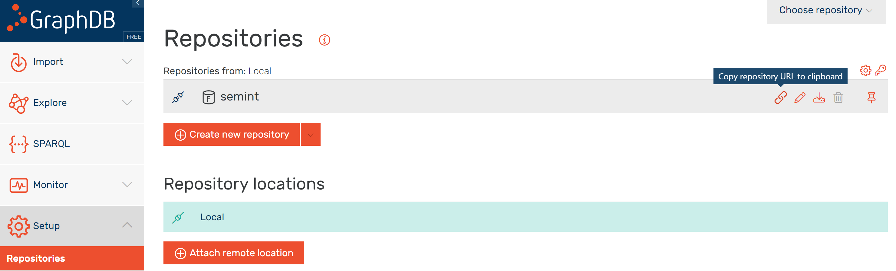
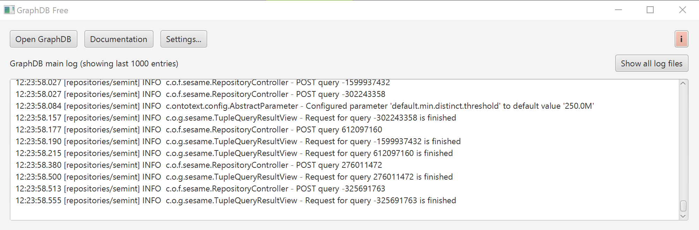

# Requirements
Tutorials and assignments of this course require installation of some tools to mimic a common architecture of 
Linked Data applications. 

## Architecture
This architecture is depicted in the figure below. 

### Backend: Triplesore.
Databases built for the storage and retrieval of triples using semantic queries are called triplestores. 
The list of existing implementation is quite impressive and includes about 50 different solutions. 
For tutorial we will install and use **[GraphDB](https://www.ontotext.com/products/graphdb/)**, 
developed by [Ontotext](https://www.ontotext.com/), because it has: 
- a lovely Graphical User Interface
- a support of [geoSPARQL](http://graphdb.ontotext.com/documentation/free/geosparql-support.html)
- a free version


#### Installation of GraphDB.

- **Step 1.** Go to the [page of GraphDB](https://www.ontotext.com/products/graphdb/) to get a free copy of the software.
- **Step 2.** Fill the form and request a link to your copy of the software. You should receive a email with download links. 
- **Step 3.** Download and install a desktop version of the software for your platform (see [quick start quid](http://graphdb.ontotext.com/documentation/8.9/free/quick-start-guide.html#run-graphdb-as-a-desktop-installation)).   
- **Step 4.** Run GraphDB. The Web interface of the triple store is available at [http://localhost:7200/](http://localhost:7200/).

#### Test the installation

- **Step 5.** Create a test repository. [See instructions on how to...](http://graphdb.ontotext.com/documentation/8.9/free/quick-start-guide.html#create-a-repository).
- **Step 6.** Query the created repository. GraphDB automatically loads core vocabularies to 
a new repository. These can be queried. Therefore, select the created repository from the 
 drop down menu, and click the SPARQL menu tab. Run the default query that returns 
 the first 100 triples from the repository:
 
 ```` sparql
 select * 
 where {
      	?s ?p ?o .
     } limit 100      
````

The query results will be rendered as a table. 

### Allow requests from other domains

- **Step 7.** Learn the endpoint address of your GraphDB. Go to *Setup* -> *Repositories* 
and *copy repository URL to clipboard*. See the figure:

  
  
  In GraphDB, the generic schema for the repository URL looks 
  like:
  ```
  http://{ip_address}:{port}/repositories/{repository_ID}
  ```
  
  The repository URL can 
  be used to query your data from other Web pages which makes it part of the Web of Data.  

- **Step 7.** 





# Frontend: 

## YASGUI: Yet Another Sparql GUI


Can be accessed on yasgui.org.
Can be integrated into a wab page like this:

## Sparklis